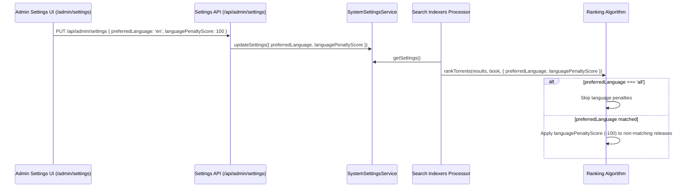

# Design: Configurable Preferred Language and Penalty Scoring

## Architecture Overview



## Component Specification

### 1. `src/lib/services/system-settings.service.ts`
- Schema addition:
  ```typescript
  preferredLanguage: z.enum(['en', 'de', 'es', 'fr', 'all']).default('en'),
  languagePenaltyScore: z.number().min(0).max(1000).default(100),
  ```
- Env fallbacks:
  `process.env.PREFERRED_AUDIOBOOK_LANGUAGE`, `process.env.LANGUAGE_PENALTY_SCORE`.

### 2. `src/lib/utils/ranking-algorithm.ts`
- Option interface extension:
  ```typescript
  export interface RankTorrentsOptions {
    preferredLanguage?: 'en' | 'de' | 'es' | 'fr' | 'all';
    languagePenaltyScore?: number;
    // ...
  }
  ```
- If `preferredLanguage === 'all'`, language filtering is disabled.
- Penalty calculation uses `-Math.abs(languagePenaltyScore)`.

### 3. Frontend Admin Settings UI
- Dropdown select for `preferredLanguage` (`English`, `German`, `Spanish`, `French`, `All (Disable Filtering)`).
- Number input field for `languagePenaltyScore`.
