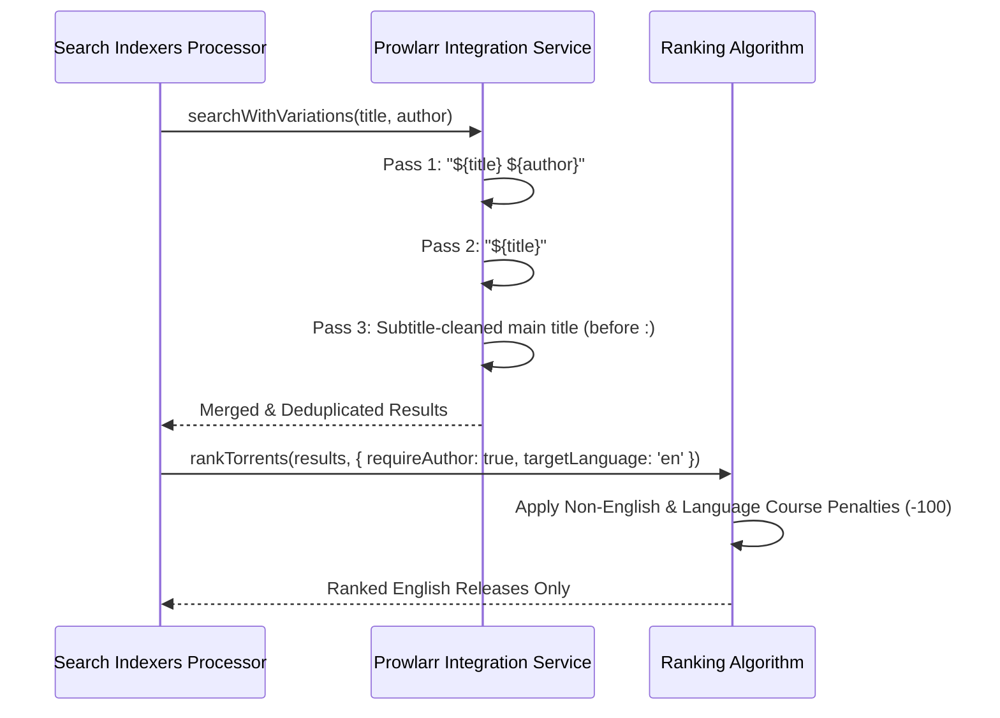

# Design: Enhance English Language Filtering and Subtitle Search

## Architecture Overview

## Component Specification

### 1. `src/lib/integrations/prowlarr.service.ts`
- `searchWithVariations(title, author)` executes 3 query passes:
  1. `${title} ${author}`
  2. `${title}`
  3. `${mainTitle}` (subtitle removed before `:` or ` - `)

### 2. `src/lib/utils/ranking-algorithm.ts`
- Detects non-English tags (`[German]`, `Hörbuch`, `[French]`, `Livre Audio`, `[Spanish]`, `Audiolibro`).
- Detects language course tags (`Pimsleur`, `Learn Spanish`, `Berlitz`).
- Applies -100 penalty when `targetLanguage === 'en'`.
