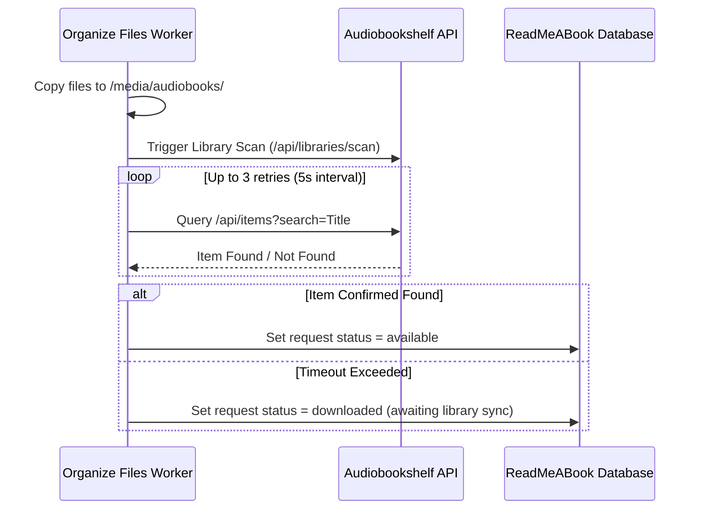

# Design: Enhance Library Sync Verification and Ebook Resilience

## Architecture Overview

## Detailed Component Design

### 1. ABS Verification Helper (`audiobookshelf-library.service.ts`)
- Add method `verifyItemExists(title: string, author?: string): Promise<boolean>`
- Searches ABS library items endpoint and checks title match similarity ($\ge 0.85$).

### 2. Ebook Scraper Timeout Handling (`find-missing-ebooks.processor.ts`)
- Wrap Flaresolverr requests in exponential backoff logic (1s, 2s, 4s).
