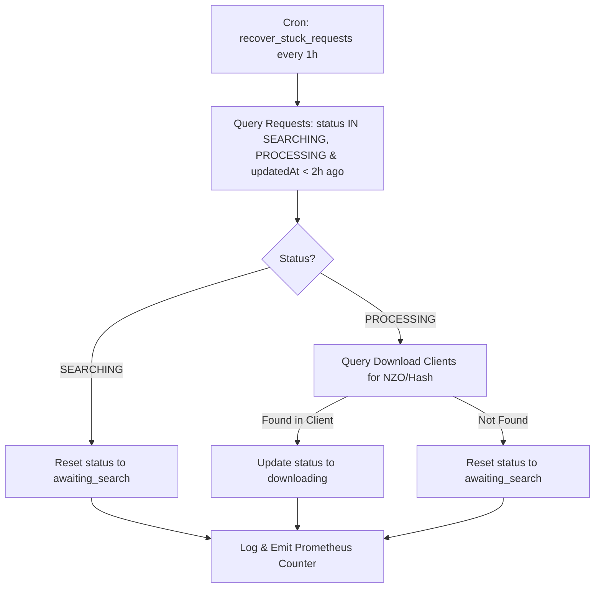

# Design: Fix Stuck Request Timeouts and Stale State Recovery

## Architecture Overview



## Detailed Component Design

### 1. `recover-stuck-requests.processor.ts`
- **Location:** `src/lib/processors/recover-stuck-requests.processor.ts`
- **Threshold:** 2 Hours (`STUCK_TIMEOUT_MS = 2 * 60 * 60 * 1000`)
- **Logic:**
  ```typescript
  const cutoff = new Date(Date.now() - 2 * 60 * 60 * 1000);
  const stuckRequests = await prisma.request.findMany({
    where: {
      status: { in: ['searching', 'processing'] },
      updatedAt: { lt: cutoff },
      deletedAt: null,
    },
  });
  ```

### 2. Download Client Re-Verification
Before resetting `PROCESSING` requests to `awaiting_search`, the processor queries SABnzbd / qBittorrent using `downloadId` or `nzo_id`. If the item is actively downloading or in complete history, the request is updated to `downloading` or `downloaded` instead of being reset to search.

## Migration & Operational Plan
- Register job type `recover_stuck_requests` in `SchedulerService`.
- Add endpoint `POST /api/admin/requests/reset-stuck`.
