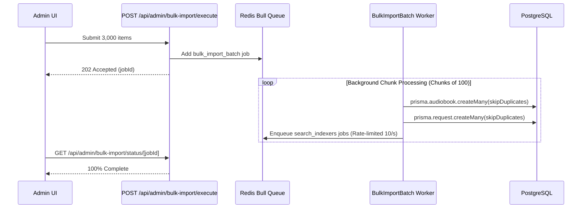

# Design: Scale Bulk Ingestion and Queue Concurrency

## Architecture Overview

## Component Specification

### 1. `POST /api/admin/bulk-import/execute`
- Receives array of up to 5,000 items.
- Validates path safety roots.
- Returns `{ success: true, jobId, totalItems: 3000 }` with HTTP status 202.

### 2. `bulk-import-batch.processor.ts`
- Processes items in chunks of 100 using Prisma batch operations.
- Calls `jobQueue.addSearchJob` for each created request.
